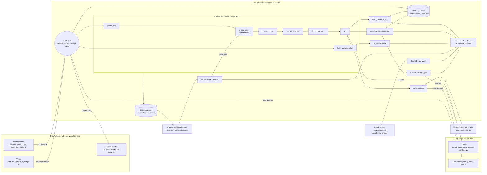
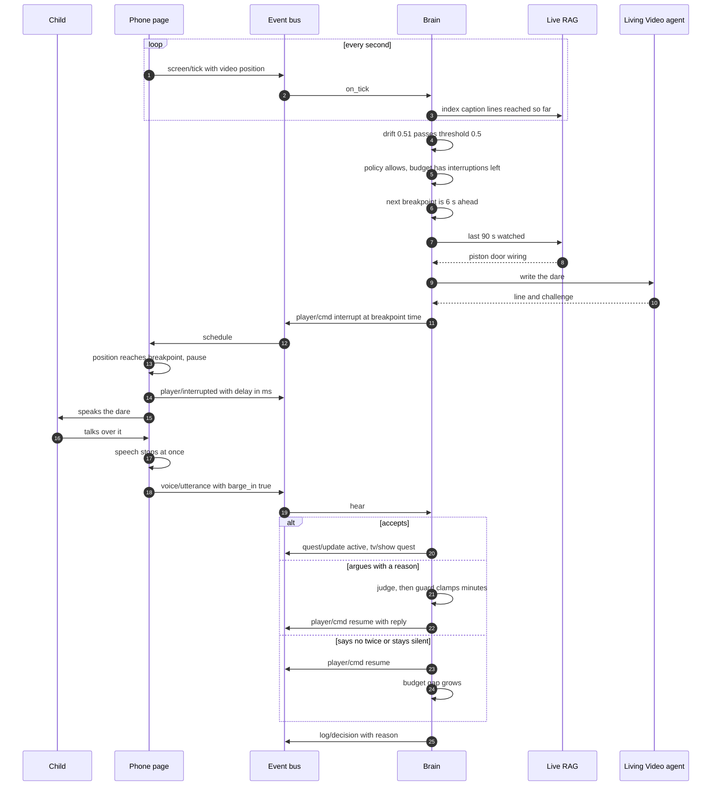
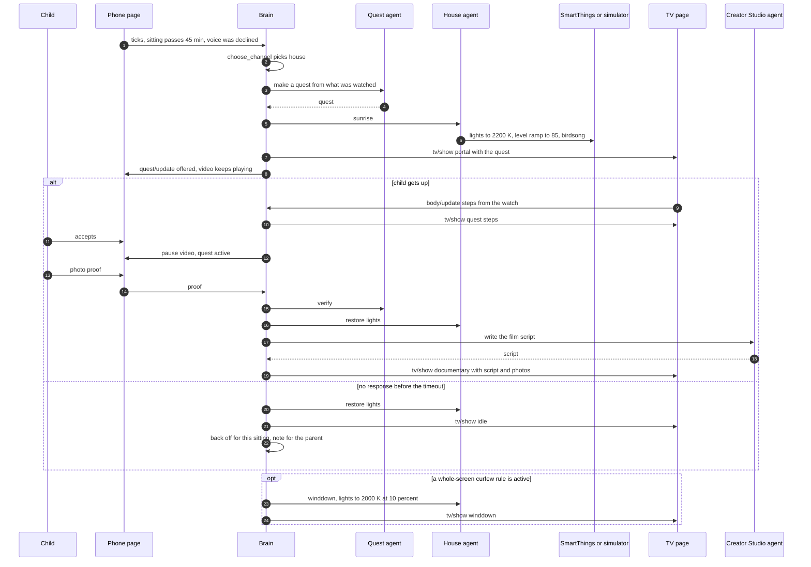

# Deliverable 2: Architecture (as built)

This describes the code in this repo. Where it differs from the first design, the table at the end says how and why.

## Devices and agents

## The Brain's graph

Three kinds of event enter one LangGraph `StateGraph`. Every path ends in `log`.

| Event | Path |
|---|---|
| `tick` (every second from the phone) | `score_drift → check_policy → gate → check_budget → choose_channel → find_breakpoint → act → log` |
| `utterance` (the child speaks or types) | `hear → explain / accept / judge / rule_held / chat → log` |
| `timeout` (no reply) | `timeout → log` |

- `check_policy` can jump straight to `act` when a family rule forbids the content. That is the only immediate block.
- `gate` stops when drift is below 0.5, an agreed extension is running, or PORTAL has already backed off this sitting.
- `choose_channel` picks the house when a voice suggestion was declined and the sitting has passed 45 minutes; the house channel does not wait for a breakpoint because it does not pause the video.
- The model is called only inside `act`, `accept` and `judge`, and only for words.

**Drift score** (0 to 1): `0.35·session + 0.25·short_form + 0.20·passivity + 0.20·stillness`, each term 0 to 1. With no watch paired, stillness is dropped and the other weights are re-normalised. The weights are starting values to tune in a pilot.

## Sequence: Living Video

## Sequence: The House Reacts

## Built versus first design

| Layer | First design | Built | Why |
|---|---|---|---|
| Event bus | MQTT broker | WebSocket fan-out inside the hub, with MQTT-style topics and retained messages | One process to start on Windows; swapping in Mosquitto later changes `bus.py` only |
| Vector store | Chroma with a sentence-embedding model | Hashed bag-of-words vectors in NumPy | The window is a few hundred lines; a heavy dependency bought nothing |
| Speech in | faster-whisper with Silero VAD | Chrome Web Speech API | Minutes to integrate. It is a cloud service, and the page says so |
| Speech out | Piper | Browser `speechSynthesis` | Already on-device and needs no model download |
| LLM | Gemma via Ollama | Same, with a scripted fallback for every agent | The demo must survive a missing or slow model |
| Game Forge | Model writes an HTML/JS game | Model writes a validated rules object; fixed engine runs it | No model-written code runs on a child's device, and the rules map directly to blocks |
| Documentary | ffmpeg render to a file | Rendered live on the TV page | No ffmpeg on the demo laptop |
| Phone sensing | UsageStats, MediaSession, Accessibility | The PORTAL player page only | Native Android service not built |

## Latency

See `06-evaluation.md`. Measured: Brain tick 5 ms median, pause 37 ms after the breakpoint in one headless run. Not measured: model-written lines and barge-in with a real microphone.
